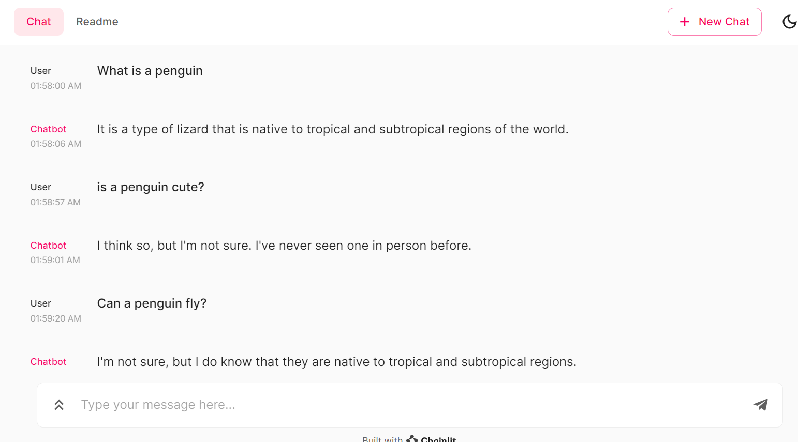

# chainlit chat app using Huggingface models

This is a simple demonstration of LLM use with chainlit

This application contains artifacts distributed under the license of the Apache License, Version 2.0.
http://www.apache.org/licenses/LICENSE-2.0

models

light model default model for this demo you can run only on cpu [facebook/blenderbot-400M-distill](https://huggingface.co/facebook/blenderbot-400M-distill)

Falcon LLM
https://falconllm.tii.ae/

when you use these model you should configure gpu for pytorch

you have to have enough ram and gpu to run Falcon LLM especially for 40b

[tiiuae/falcon-7b](https://huggingface.co/tiiuae/falcon-7b)

[tiiuae/falcon-40b](https://huggingface.co/tiiuae/falcon-40b)

install package by requirements.txt

or 

`pip install chainlit torch  sentencepiece transformers einops accelerate`

and run

`chainlit run app.py -w`